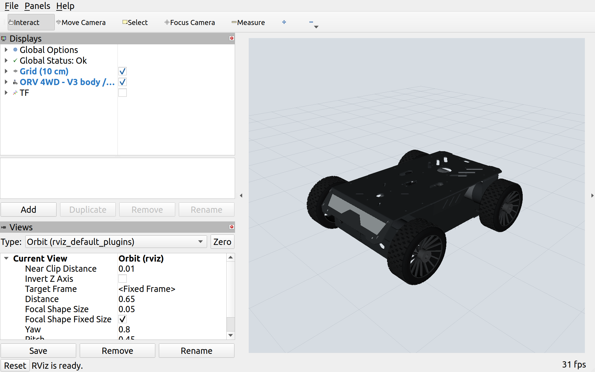
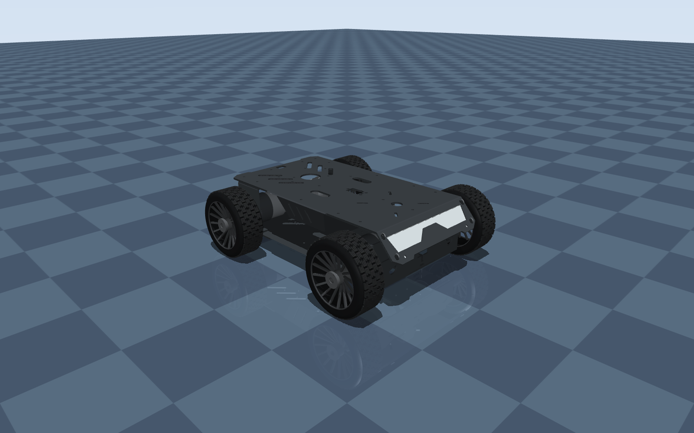
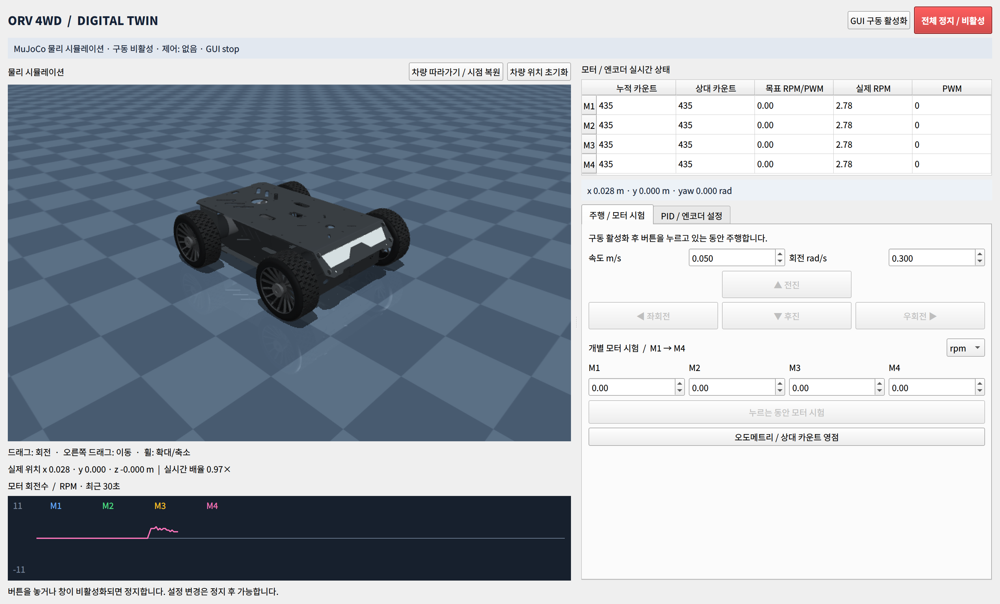

# ORV 4WD ROS 2 패키지

Arduino UNO R3와 QGPMaker 모터 실드로 일반 바퀴 4개를 제어하는 초기 구현입니다. Raspberry Pi 4B의 Ubuntu 22.04 ARM64 / ROS 2 Humble을 대상으로 하며, Ubuntu·Windows PC의 GUI는 Pi의 HTTP API에 연결합니다. 기본 실행은 **모의 장치이며 구동 비활성 상태**입니다.



*상세 URDF를 RViz에서 실행한 실제 화면입니다.*

## 구성

| 패키지 | 역할 |
|---|---|
| `orv_4wd` | USB 시리얼 통신, 구동 상태 관리, 차동 구동 운동학·오도메트리, ROS 인터페이스, 설정 API |
| `orv_bringup` | 차량 launch, domain_bridge, 모의/실물·통신 설정 |
| `orv_description` | STEP 기반 판금 차체와 사진 기반 고무 바퀴를 사용하는 RViz 모델 |
| `orv_firmware` | UNO용 엔코더·PID·PWM 제어와 동봉 PS2형 무선 수신기 통합 펌웨어 |
| `orv_gui` | ROS 설치 없이 실행할 수 있는 Qt 설정 앱 |
| `orv_mujoco` | MuJoCo 바퀴·접촉 물리 시뮬레이션 및 실차 토픽 미러 |

현재 ROS 드라이버는 `rclpy`로 구현했습니다. `ros2_control`의 `SystemInterface` 플러그인은 이 버전에 포함하지 않았습니다. `/cmd_vel`, `/odom`, `/joint_states`, TF를 제공하므로 표준 ROS 주행 명령과 상태 확인이 가능합니다.

## 확정 사양과 미확정 사양

- 일반 바퀴 4륜, 좌우 속도 차이를 이용하는 스키드 스티어 방식
- 바퀴 지름 88 mm (사용자 확인), 반경 44 mm = 0.044 m
- 좌우 바퀴 바깥쪽 끝 사이 전체 폭 245 mm (사용자 확인)
- 바퀴 폭 좌우 각각 35 mm (사용자 확인), 좌우 중심 간격 210 mm = 0.210 m
- 차체 전면부터 후면까지 길이 290 mm = 0.290 m (사용자 확인)
- 차체 자체 높이 67 mm = 0.067 m (사용자 확인, 지면부터의 높이와 별도)
- 지면에서 차체 바닥까지 높이 21 mm = 0.021 m (사용자 확인); 차체 중심 높이 54.5 mm, 상단 높이 88 mm
- Arduino UNO R3 / ATmega328P
- 37mm 엔코더 모터, 감속비 1:90
- Raspberry Pi 4B / Ubuntu 22.04 / ROS 2 Humble
- 사용자 제공 상품: https://ko.aliexpress.com/item/1005010618731612.html
- 분석 자료: `/home/ktj/Documents/카카오톡 받은 파일/V3_car_UNO`

제공 모터 사양표의 1:90 열은 12 V, 무부하 107 RPM, 정격 60 RPM, 정격 토크 8.5 kgf·cm, 정격 전류 ≤1.2 A, 스톨 전류 ≤3.5 A를 표기합니다. 상품 페이지와 직접 대조하지 못했으므로 실제 모터 라벨과 전원을 확인해야 합니다.

**CPR 4320은 잠정값**입니다. 제공 코드의 `12 PPR × 4 × 90`과 사양표의 감속 후 990라인이 일치하지 않습니다. 바퀴 10회전을 수동으로 돌려 누적 카운트 차이의 절댓값을 10으로 나누어 바퀴별 CPR을 확인하세요. GUI의 CPR은 이미 4배 계수를 반영한 **바퀴 출력축 1회전당 카운트**이며, 감속비나 4를 추가로 곱하지 않습니다.

실물·모의 설정과 URDF 기본 반경에 지름 88 mm를 반영해 `wheel_radius: 0.044`를 사용합니다. **전체 바깥 폭 245 mm는 바퀴 중심 간격(`track_width`)과 다릅니다.** 좌우 바퀴 폭이 각각 35 mm로 같으므로 `중심 간격 = 245 - 35 = 210 mm`입니다. 실물·모의 설정의 `track_width`는 0.210 m이며, URDF도 같은 치수를 사용합니다. 차체 길이는 `chassis_length: 0.290`, 높이는 `chassis_height: 0.067`, 지상고는 `ground_clearance: 0.021`입니다. 차체 중심 Z는 `지상고 + 차체 높이 / 2 = 0.0545 m`로 계산합니다. 차체는 제공된 STEP를 메시로 변환해 실측 외곽 치수에 맞췄고, 일반 고무 바퀴와 일부 외장 부품은 사진을 참고해 재구성했습니다. 앞뒤 바퀴 중심 간격(200 mm)과 차체 폭(155 mm)은 아직 가정값입니다. [모델 형상과 생성 방법](docs/MODEL.md)을 참고하세요.

## 빌드와 모의 실행

새 Pi에서는 ROS 2 Humble과 colcon을 준비한 뒤 `rosdep install --from-paths src --ignore-src --rosdistro humble -r -y`로 패키지 의존성을 설치합니다. GUI PC에는 PySide6 또는 PyQt5가 필요합니다.

```bash
cd /home/ktj/ORV_4WD
source /opt/ros/humble/setup.bash
colcon build --symlink-install
source install/setup.bash
export ROS_DOMAIN_ID="$(ros2 run orv_bringup domain_id vehicle)"
ros2 launch orv_bringup bringup.launch.py
```

GUI는 별도 터미널에서 실행합니다.

```bash
source /opt/ros/humble/setup.bash
source /home/ktj/ORV_4WD/install/setup.bash
ros2 run orv_gui tuner
```

`http://127.0.0.1:8765`로 연결한 다음 `GUI 구동 활성화`를 누릅니다. 주행/모터 시험 버튼은 누르고 있는 동안만 명령을 보냅니다. 버튼을 놓거나 GUI 창이 비활성화되면 정지·구동 해제합니다. 한 번 해제되면 다시 활성화해야 합니다. 창이 멎거나 연결이 끊겨도 호스트와 UNO의 별도 타임아웃이 작동합니다.

`mode:=mock` 장치는 1차 지연으로 회전수를 근사합니다. 실제 바퀴 마찰, 슬립, 전류, 전원 강하, 모터별 배선 부호, PID 응답을 검증하는 물리 시뮬레이터는 아닙니다. 접촉 동역학을 계산하려면 아래 MuJoCo 실행을 사용합니다.

## RViz에서 URDF 보기

```bash
source /opt/ros/humble/setup.bash
source /home/ktj/ORV_4WD/install/setup.bash
ros2 launch orv_description display.launch.py
```

차체와 바퀴 4개를 표시하는 전용 실행입니다. 바퀴 지름은 88 mm, 바퀴 폭은 각각 35 mm, 전체 바깥 폭은 245 mm입니다. `outer_width`와 `wheel_width`에서 중심 간격 210 mm를 자동 계산합니다. 별도로 `track_width`에 양수를 지정하면 중심 간격을 우선하여 전체 폭도 달라집니다. 치수 인자의 단위는 미터입니다. 모터 드라이버 없이 관절 상태와 TF만 발행합니다. 실제 bringup과 동시에 실행하면 관절 상태가 중복되므로 별도로 사용하세요. RViz의 `TF` 체크박스로 좌표축을 표시할 수 있습니다.

각 바퀴의 연결 구조는 `base_link → chassis_link → *_axle_link → *_wheel_link`입니다. 차체에서 바퀴 중심까지 은색 연결축을 표시하며, 바퀴는 중심의 `*_wheel_joint`에서 Y축을 기준으로 회전합니다. 연결축 지름 12 mm는 시각화용 가정값이며 `axle_radius`로 조정합니다. 기존 바퀴 관절 이름과 `/joint_states` 제어 인터페이스는 같습니다.

상세 형상은 패키지에 포함된 COLLADA 메시로 표시하므로 Raspberry Pi에서 CAD 변환 도구를 설치할 필요가 없습니다. 상판 타공, 전면 경사창·브래킷, 측면 통풍구, 타이어 트레드·스포크가 포함됩니다. 충돌 형상은 차체 박스와 바퀴 원통으로 단순화했으며, 물리 시뮬레이션용 질량·관성은 아직 정의하지 않았습니다.

## MuJoCo 디지털 트윈



실측 형상과 기존 상세 메시를 사용하고, 바퀴별 토크·지면 접촉·미끄러짐을 계산합니다. **질량·마찰·모터 토크는 아직 실측 전 임시값**입니다. 가상 엔코더 기반 `/odom`과 물리 엔진의 `/orv/sim/ground_truth`를 비교할 수 있습니다.

```bash
cd /home/ktj/ORV_4WD
source /opt/ros/humble/setup.bash
python3 -m pip install --user -r src/orv_mujoco/requirements.txt
colcon build --symlink-install
source install/setup.bash
ros2 launch orv_mujoco simulation.launch.py
```

이후에는 [실행 쉘 파일](run_simulation.sh) 하나로 ROS 환경 설정과 통합 시뮬레이션 실행을 처리할 수 있습니다. 어느 폴더에서 호출해도 동작하며, 실행 파일이 아직 빌드되지 않았다면 필요한 패키지를 먼저 빌드합니다.

```bash
/home/ktj/ORV_4WD/src/run_simulation.sh
# 장애물 코스: 위 명령 뒤에 --course
# 화면 없이 실행: --headless / 다시 빌드: --build
```

현재 PC에서는 `/home/ktj/ORV_4WD/run_simulation.sh`로도 실행할 수 있습니다. 추가 `terrain:=course`, `bridge:=true`, `rviz:=true` 등의 인자는 ROS launch에 그대로 전달합니다. 통합 창을 닫거나 터미널에서 `Ctrl+C`로 종료하세요. 이미 실행 중이라면 종료 후 다시 실행합니다.

**한 창에 MuJoCo 차량 화면·RPM 그래프·네 모터의 엔코더/RPM/PWM·주행 버튼이 함께 표시됩니다.** 오른쪽 탭에서 PID·엔코더·출력 제한도 조절합니다. `GUI 구동 활성화` 후 주행 버튼을 누르고 있는 동안 움직이며, 버튼을 놓거나 창이 비활성화되면 출력이 해제됩니다. 마우스 드래그로 시점을 돌리고 휠로 확대할 수 있습니다. `terrain:=course`로 경사판·장애물 코스를, `viewer:=false gui:=false`로 화면 없는 실행을 선택합니다.



시뮬레이션은 별도 localhost 도메인을 사용합니다. `bridge:=true`를 추가하면 조종 PC에서 `/orv_sim/...` 토픽으로 연결할 수 있습니다. 실제 차량의 `/orv/...`와 구분하며 서비스는 시뮬레이션 도메인에서 호출합니다.

실제 차량 bringup과 기존 domain_bridge를 실행한 PC에서는 다음 명령으로 **실차 오도메트리·바퀴 상태를 따라가는 미러**를 열 수 있습니다. 이 실행은 주행 명령을 발행하지 않습니다.

```bash
ros2 launch orv_mujoco mirror.launch.py
```

[실행·ROS 제어·물리 보정·검증 방법](docs/MUJOCO.md)에 정리했습니다. 실차 미러는 엔코더 추정 위치를 표시하며, 실제 차량과의 연결은 아직 실물로 검증하지 않았습니다.

## 차량 ↔ 조종 PC: domain_bridge

ROS 토픽은 **조종 PC ↔ domain_bridge ↔ Raspberry Pi ↔ USB ↔ UNO** 경로로 전달합니다. 차량과 PC의 도메인 설정은 [domain_bridge.yaml](orv_bringup/config/domain_bridge.yaml)의 `from_domain`(차량), `to_domain`(PC)에 있습니다. 양쪽에 같은 설정 파일을 사용하세요. README에는 실제 도메인 ID를 기재하지 않습니다.

차량 `bringup.launch.py`는 이 설정의 차량 도메인으로 드라이버와 `robot_state_publisher`를 실행합니다. 브릿지 launch와 원격 RViz는 PC 도메인을 사용합니다. 터미널의 CLI는 아래 `domain_id` 명령으로 역할에 맞게 설정합니다. 사용자 전체의 셸 설정은 변경하지 않습니다.

Ubuntu 조종 PC에 ROS 2 Humble과 이 워크스페이스를 빌드하고 브릿지 의존성을 설치합니다.

```bash
sudo apt install ros-humble-domain-bridge
source /opt/ros/humble/setup.bash
source /home/ktj/ORV_4WD/install/setup.bash
export ROS_DOMAIN_ID="$(ros2 run orv_bringup domain_id operator)"
unset ROS_LOCALHOST_ONLY
ros2 launch orv_bringup domain_bridge.launch.py rviz:=true
```

브릿지는 **PC에서 한 번만** 실행합니다. Pi에서도 네트워크 통신 시 `ROS_LOCALHOST_ONLY`를 해제하고 차량 bringup을 실행하세요. 두 장치는 DDS 검색·통신이 가능한 같은 로봇 LAN에 연결되어 있어야 합니다. `rviz:=false`가 기본이며 토픽 전달만 실행할 수도 있습니다. 원격 RViz는 차량의 URDF·TF를 받아 표시하므로 이때 `display.launch.py`를 함께 실행하지 않습니다. 메시 파일은 PC의 `orv_description` 패키지에서 읽습니다.

현재 개발 PC에서는 공식 Humble Debian 패키지를 사용자 경로 `~/.local/share/orv_4wd/domain_bridge/opt/ros/humble`에 풀어 실행을 검증했습니다. launch는 시스템에 설치된 패키지를 우선 사용하고, 없으면 이 경로를 사용합니다. 새 장치에서는 위 apt 설치 또는 rosdep을 사용하세요.

| 방향 | 출발 토픽 | 도착 토픽 |
|---|---|---|
| PC → 차량 | `/orv/cmd_vel` | `/cmd_vel` |
| 차량 → PC | `/odom` | `/orv/odom` |
| 차량 → PC | `/joint_states` | `/orv/joint_states` |
| 차량 → PC | `/orv/status` | `/orv/status` |
| 차량 → PC | `/tf` | `/orv/tf` |
| 차량 → PC | `/tf_static` | `/orv/tf_static` |
| 차량 → PC | `/robot_description` | `/orv/robot_description` |

PC에서는 `/orv/...`를 사용해 다른 로봇의 토픽과 구분합니다. 원격 RViz launch에 TF와 모델 설명 토픽 remap이 포함되어 있습니다. 다른 ROS 노드를 연결할 때도 표의 PC 토픽으로 remap하세요. TF 내부의 프레임 이름은 그대로 유지됩니다. 고정 TF·모델 설명에는 `transient_local`을 사용하므로 RViz를 나중에 켜도 수신할 수 있습니다. 속도 명령은 volatile, depth 1, 브릿지 출력 lifespan 0.2초로 설정했습니다. [domain_bridge 공식 문서](https://github.com/ros2/domain_bridge)를 참고하세요.

## ROS에서 주행

GUI 구동을 해제한 상태에서 ROS 소스를 활성화합니다. GUI와 ROS는 동시에 주행 권한을 갖지 않습니다. **현재 YAML 브릿지는 토픽을 전달하며 서비스는 전달하지 않습니다.** 구동 활성화·정지·설정 저장 서비스는 Pi 터미널(또는 SSH 접속한 Pi 터미널)에서 차량 도메인으로 호출하세요.

차량 터미널:

```bash
source /opt/ros/humble/setup.bash
source /home/ktj/ORV_4WD/install/setup.bash
export ROS_DOMAIN_ID="$(ros2 run orv_bringup domain_id vehicle)"
ros2 service call /orv/arm std_srvs/srv/SetBool '{data: true}'
```

조종 PC의 별도 터미널에서 명령을 발행합니다. 활성화 후 명령이 없으면 빠르게 해제되므로, PC 발행을 먼저 시작한 뒤 차량에서 활성화해도 됩니다. 비활성 상태에서는 속도 명령을 무시합니다.

```bash
source /opt/ros/humble/setup.bash
source /home/ktj/ORV_4WD/install/setup.bash
export ROS_DOMAIN_ID="$(ros2 run orv_bringup domain_id operator)"
ros2 topic pub --rate 10 /orv/cmd_vel geometry_msgs/msg/Twist \
  '{linear: {x: 0.05}, angular: {z: 0.0}}'
```

발행 중단이나 브릿지 연결 단절로 차량에 명령이 도착하지 않으면 기본 0.5초 후 정지·구동 해제합니다. 차량 터미널에서는 언제든 정지 서비스를 호출할 수 있습니다.

```bash
ros2 service call /orv/stop std_srvs/srv/Trigger '{}'
```

PC 도메인으로 설정한 터미널에서 상태를 확인합니다.

```bash
ros2 topic echo /orv/status --once
ros2 topic echo /orv/joint_states --once
ros2 topic echo /orv/odom --once
```

`linear.x`는 m/s, `angular.z`는 rad/s입니다. 다른 Twist 성분은 허용하지 않습니다. 목표 RPM 상한을 초과하면 좌우 비율을 유지하며 함께 줄입니다. 오도메트리는 목표 명령이 아닌 엔코더 변화량으로 계산합니다. 바퀴 치수가 0이면 바퀴 상태만 발행하고 `/odom` 및 `odom → base_link` TF는 발행하지 않습니다.

아래는 차량 도메인에서 제공하는 원래 인터페이스입니다.

| ROS 인터페이스 | 형식 | 내용 |
|---|---|---|
| `/cmd_vel` | `geometry_msgs/msg/Twist` | ROS 구동 활성화 후 주행 명령 |
| `/joint_states` | `sensor_msgs/msg/JointState` | FL, RL, FR, RR 순서의 rad·rad/s |
| `/odom` | `nav_msgs/msg/Odometry` | 엔코더 기반 평면 오도메트리 |
| `/orv/status` | `std_msgs/msg/String` | JSON: 모드, 연결·구동·설정 적용 상태, M1..M4 카운트/RPM/PWM |
| `/orv/arm` | `std_srvs/srv/SetBool` | ROS 주행 권한 활성/해제 |
| `/orv/stop` | `std_srvs/srv/Trigger` | 정지·구동 해제 |
| `/orv/reset_odometry` | `std_srvs/srv/Trigger` | 정지 상태에서 위치와 상대 엔코더 영점 초기화 |
| `/orv/save_config` | `std_srvs/srv/Trigger` | 확인된 설정을 Pi의 YAML 파일에 저장 |

정지/해제는 소프트웨어 명령입니다. I²C 고장·전원 고장까지 차단하는 물리 비상 정지 회로를 대신하지 않습니다. `RELEASE`에 해당하는 양쪽 입력 LOW를 사용하므로 관성으로 더 굴러갈 수 있습니다.

## UNO 펌웨어

통합 스케치: [`orv_uno_integrated.ino`](orv_firmware/firmware/orv_uno_integrated/orv_uno_integrated.ino). 같은 폴더의 `ps2_receiver.h`를 함께 사용합니다. 기존 `orv_uno`는 USB 전용 버전으로 보존했습니다.

Arduino IDE에서 보드를 **Arduino UNO**로 선택합니다. 외부 라이브러리 없이 AVR 코어의 `Wire`와 포함된 수신기 코드를 사용합니다. 제공 자료의 **PS2형 수신기(D10~D13)**를 기준으로 구현했으며, Pi에 직접 연결하는 Bluetooth 게임패드나 UART Bluetooth 모듈용은 아닙니다. 제조사 UartJoystick 규약과 다르므로 새 드라이버와 함께 사용해야 합니다. 실물 수신기 방식 확인과 보드 업로드는 아직 수행하지 않았습니다.

조종기 모드는 왼쪽 스틱 중립·차량 정지 상태에서 **L1 + START**로 시작하고, **L1을 누르는 동안** 왼쪽 스틱으로 주행합니다. L1을 놓으면 정지·구동 해제하며 SELECT는 어느 모드에서든 정지합니다. ROS/GUI와 조종기는 정지 후 제어권을 전환합니다. 조종 중에도 엔코더·오도메트리·TF 토픽을 계속 발행하고 `/orv/status`의 `source`는 `remote`가 됩니다.

Pi 드라이버 실행 및 확인된 모터 설정이 필요합니다. `hardware_confirmed: true`와 `remote_enabled: true`일 때 조종기를 허용하며, `remote_max_rpm` 기본값은 15입니다. GUI에서도 사용 여부와 상한을 조절합니다. USB/Pi 통신이 끊기면 조종기 모드도 구동 해제합니다. [배선·버튼·설정·검증 절차](docs/REMOTE_CONTROL.md)를 참고하세요.

Arduino CLI가 설치된 경우:

```bash
arduino-cli core install arduino:avr@1.8.6
arduino-cli compile --fqbn arduino:avr:uno \
  /home/ktj/ORV_4WD/src/orv_firmware/firmware/orv_uno_integrated
```

| 채널 | UNO 엔코더 입력 순서 | PCA9685 구동 채널 A/B |
|---|---|---|
| M1 | D8, D9 | 8, 9 |
| M2 | D6, D7 | 10, 11 |
| M3 | D3, D2 | 15, 14 |
| M4 | D5, D4 | 13, 12 |

실드는 I²C 주소 `0x60`, SDA=A4, SCL=A5로 접근합니다. **실물 실드 버전과 핀 배치를 확인해야 합니다.** 모터 전원은 별도로 공급하고 Pi와 UNO는 USB로 통신합니다. 이 펌웨어는 모터만 다루며, PCA9685 전체에 약 1 kHz를 설정하므로 서보 출력은 지원하지 않습니다.

UNO의 역할:

- A/B 양상 변화의 4배 계수와 원자적 카운트 스냅샷
- 20 ms 속도 제어 주기, 실제 경과 시간으로 RPM 계산
- 바퀴별 PID, 잠정 feed-forward `255/107 PWM/RPM`, 적분 제한, 목표 RPM 가속 제한
- PWM 시험 모드 (RPM 가속 제한이 적용되지 않음), 바퀴별 출력 상한
- 50 ms 상태 보고, 기본 300 ms 통신 타임아웃
- CRC 검증, 프레임 길이 제한, 부분 프레임 만료, 부팅 시 구동 해제
- PS2 수신기 입력, 조종기/호스트 제어권 분리, L1 유지·중립 시작·재연결 자동 구동 방지
- 모든 제어 모드에서 엔코더 상태 전송, 조종기 모드의 별도 Pi heartbeat 감시
- I²C 오류 및 제어 주기 지연 시 fault, 재시작 전 구동 금지

설정은 UNO RAM에만 적용합니다. EEPROM은 기록하지 않으며, 재시작하면 Pi가 설정을 재전송합니다. 재전송 후 자동으로 주행을 재개하지 않습니다.

## 실제 차량 연결과 보정

1. 바퀴를 지면에서 띄우고 실드·모터 전원·엔코더 배선을 확인합니다.
2. `orv_bringup/config/hardware.yaml`을 별도 파일로 복사합니다. `hardware_confirmed`는 확인 후에만 true로 바꿉니다.
3. UNO의 `/dev/serial/by-id/...` 경로로 실행합니다. 실제 포트를 자동 선택하지 않습니다.

```bash
ros2 launch orv_bringup bringup.launch.py \
  mode:=hardware \
  port:=/dev/serial/by-id/실제_UNO_장치 \
  config:=/home/ktj/ORV_4WD/hardware_calibrated.yaml
```

4. GUI 모드에서 한 모터씩 낮은 PWM으로 시험합니다. 목표 방향과 실제 엔코더 부호가 일치하도록 `motor_sign`과 `encoder_sign`을 보정합니다. **각 바퀴에서 전진 방향이 양수**가 되어야 합니다. 정지·구동 해제 후 설정을 적용합니다.
5. `motor_map`은 `[앞왼쪽, 뒤왼쪽, 앞오른쪽, 뒤오른쪽]`에 연결된 실제 M번호입니다. 나머지 모든 4개짜리 배열은 **M1, M2, M3, M4 순서**입니다.
6. 엔코더 CPR을 실측합니다. 원시 카운트는 측정값이며 GUI의 영점 초기화는 상대 표시와 오도메트리만 초기화합니다.
7. 기본 바퀴 반경은 44 mm로 설정되어 있습니다. 좌우 바퀴 중심 간 거리를 실측해 입력합니다. GUI는 mm, YAML·ROS 파라미터는 m입니다. 지름 88 mm를 반경 칸에 넣지 마세요.
8. 낮은 목표 RPM으로 응답을 확인한 뒤 PID·출력 제한·가속 제한을 조절합니다. `kp`, `ki`, `kd` 초기값은 실제 모터에서 튜닝되지 않았습니다.
9. `config_applied: true` 확인 후 Pi에 설정을 저장합니다. 기본 경로는 `~/.config/orv_4wd/profile.yaml`입니다. 다음 실행에 `config:=/home/<사용자>/.config/orv_4wd/profile.yaml`을 명시합니다.

치수와 모터 매핑을 바꾸면 정지 상태에서 오도메트리 영점을 다시 잡습니다. 반경·간격 변경 후 RViz 모델까지 일치시키려면 저장된 설정으로 bringup을 재시작하세요. 실제 4륜 스키드 스티어는 회전 중 슬립이 있으므로 유효 좌우 간격과 오도메트리 오차를 주행 시험으로 보정해야 합니다.

## Ubuntu / Windows GUI

Ubuntu에서 ROS 없이 GUI만 설치하는 경우:

```bash
python3 -m venv .venv
source .venv/bin/activate
python -m pip install '/home/ktj/ORV_4WD/src/orv_gui[qt]'
tuner
```

Windows에서는 `orv_gui` 디렉터리를 복사하고 Python 3.10 이상 환경에서 설치합니다.

```powershell
py -3.10 -m venv .venv
.venv\Scripts\Activate.ps1
python -m pip install ".\orv_gui[qt]"
tuner
```

GUI는 PySide6 6.8 계열을 사용하며, Ubuntu에 PyQt5만 설치되어 있으면 이를 사용합니다. Linux GUI 검증은 PyQt5로 수행했습니다. Windows 실행과 `.exe` 패키징은 별도 Windows 환경에서 검증해야 합니다.

Pi를 원격으로 사용할 때는 영문·숫자 등 ASCII 문자로 된 16자 이상의 토큰을 지정합니다. 기본 API는 localhost에만 열립니다.

```bash
export ORV_API_TOKEN='replace-with-your-own-random-token'
ros2 launch orv_bringup bringup.launch.py api_bind:=0.0.0.0
```

GUI 주소를 `http://<Pi의 IP>:8765`로 바꾸고 같은 토큰을 입력합니다. 이 명령도 기본은 mock이며 실제 주행에는 앞 절의 hardware 인자를 추가합니다. HTTP API는 신뢰하는 로봇 LAN에서 사용하거나 SSH 터널로 연결하세요. 인터넷 공개용 서버가 아닙니다.

GUI의 JSON 내보내기는 적용 확인된 설정을 저장합니다. JSON 불러오기는 입력 칸에만 반영하며 `설정 적용`을 눌러야 장치에 전달됩니다. Pi YAML과 PC JSON은 형식이 다릅니다.

## 검증

```bash
cd /home/ktj/ORV_4WD
source /opt/ros/humble/setup.bash
source install/setup.bash
colcon test --packages-select orv_4wd
colcon test-result --verbose
# 사용하지 않는 테스트 도메인을 환경 변수에 지정한 뒤 실행합니다.
: "${ORV_TEST_VEHICLE_DOMAIN_ID:?테스트용 차량 도메인을 지정하세요}"
: "${ORV_TEST_OPERATOR_DOMAIN_ID:?테스트용 PC 도메인을 지정하세요}"
ROS_DOMAIN_ID="$ORV_TEST_VEHICLE_DOMAIN_ID" ROS_LOCALHOST_ONLY=1 \
  python3 src/tools/integration_check.py
python3 src/tools/domain_bridge_check.py \
  --vehicle-domain "$ORV_TEST_VEHICLE_DOMAIN_ID" \
  --operator-domain "$ORV_TEST_OPERATOR_DOMAIN_ID"
python3 src/tools/remote_integration_check.py --domain "$ORV_TEST_VEHICLE_DOMAIN_ID"
python3 src/tools/gui_check.py
```

`integration_check.py`는 임의의 로컬 API 포트와 mock 장치를 사용하고 자신이 시작한 프로세스만 종료합니다. `domain_bridge_check.py`는 서로 다른 두 localhost 테스트 도메인에서 실제 브릿지 실행 파일로 명령·상태·TF 전달, 늦게 접속한 구독자의 정적 데이터 수신, 브릿지 단절 시 구동 해제를 확인합니다. 설정된 실사용 도메인을 테스트에 지정하면 거부합니다. 테스트 도메인은 다른 실행 중인 로봇과도 겹치지 않게 선택하세요.

동작 검증 범위는 [검증 기록](docs/VALIDATION.md), 통신 구현 사양은 [프로토콜](docs/PROTOCOL.md)에 정리했습니다.

패키지의 maintainer 이메일 `ktj@example.invalid`는 배포 전 교체할 자리표시자입니다.
